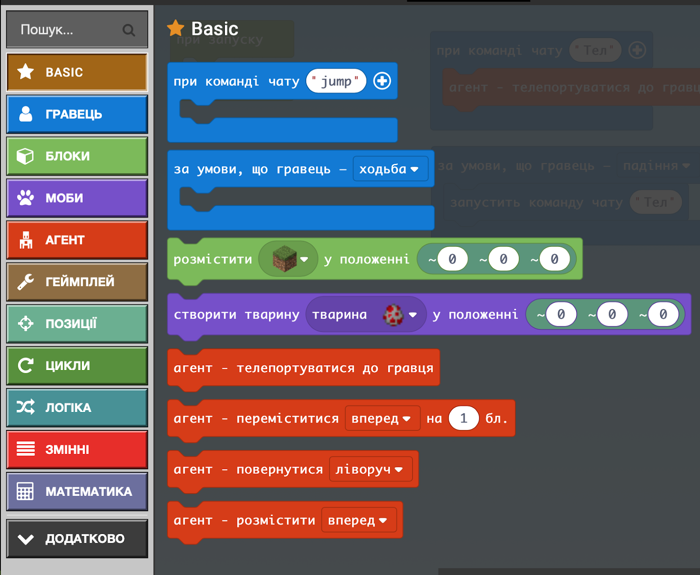
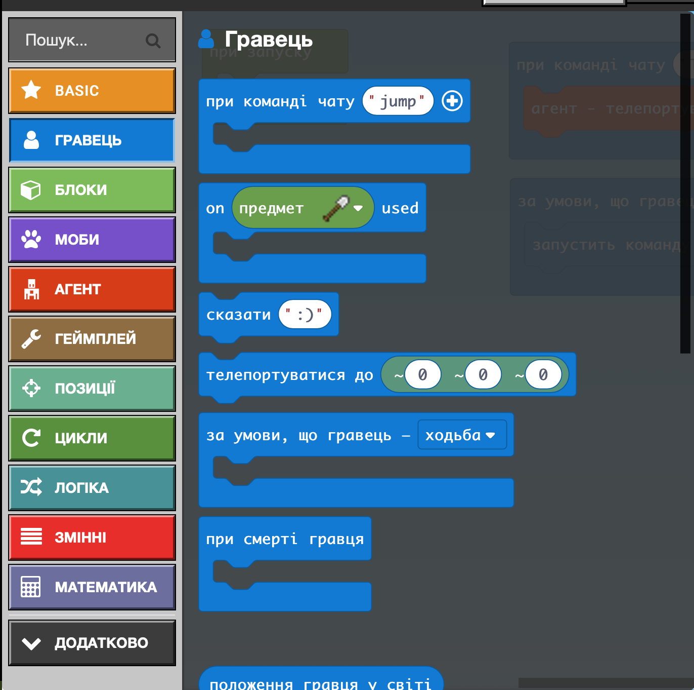

# Заняття 4. Програмний код

### Агент

Використовуємо блоки Basic i Гравець

### Агент - ваш помічник і виконує завдання

Він не може садити дерева в повітря чи в тому місці де вже щось чи хтось стоїть

Програма говоритиме про помилки
