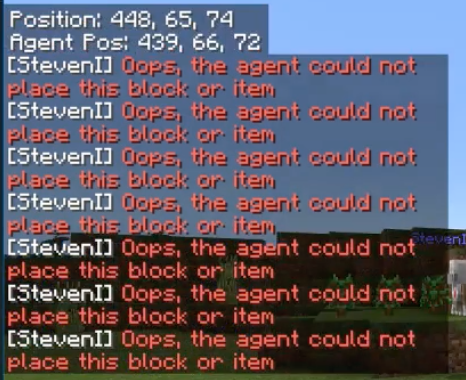
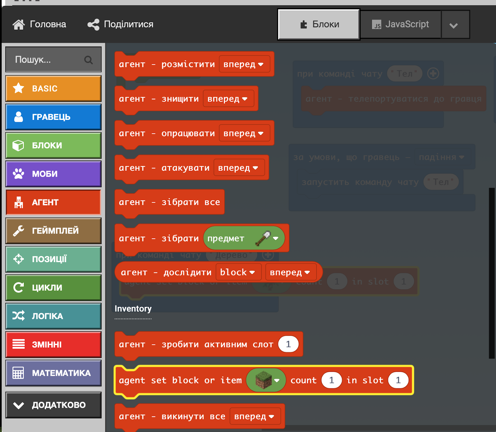
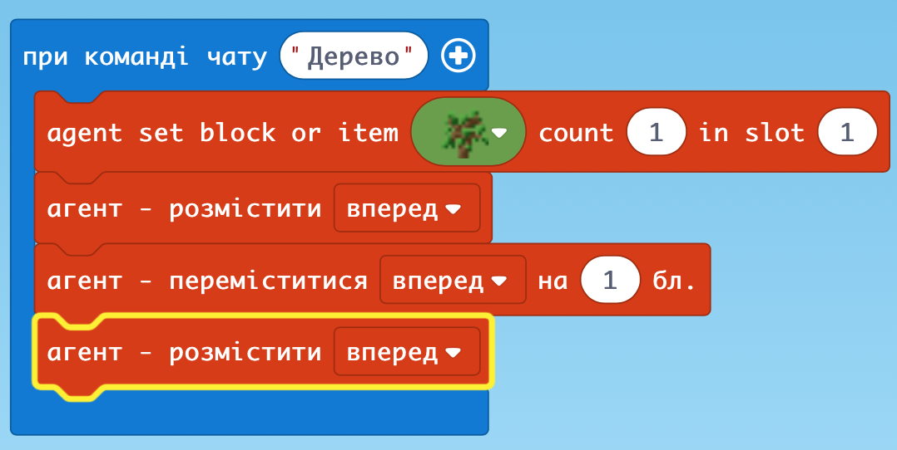
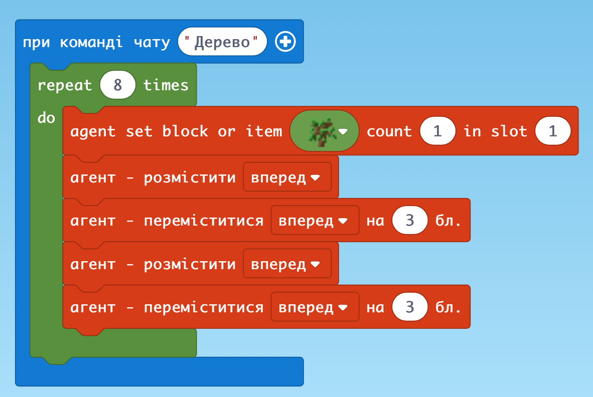
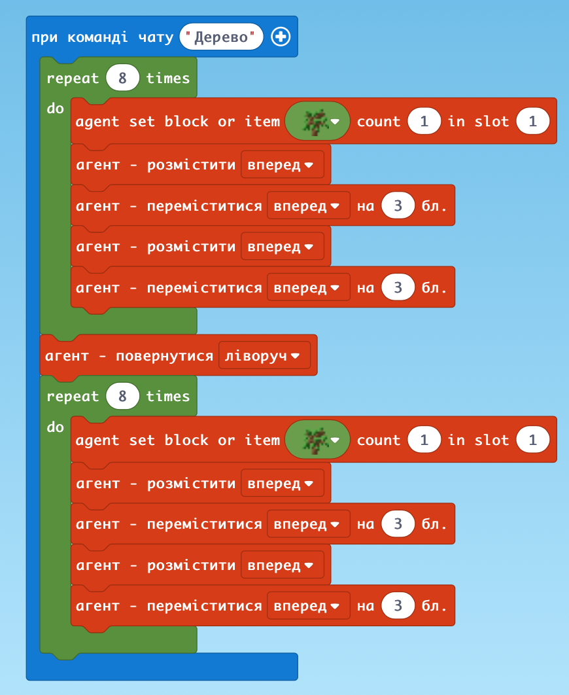
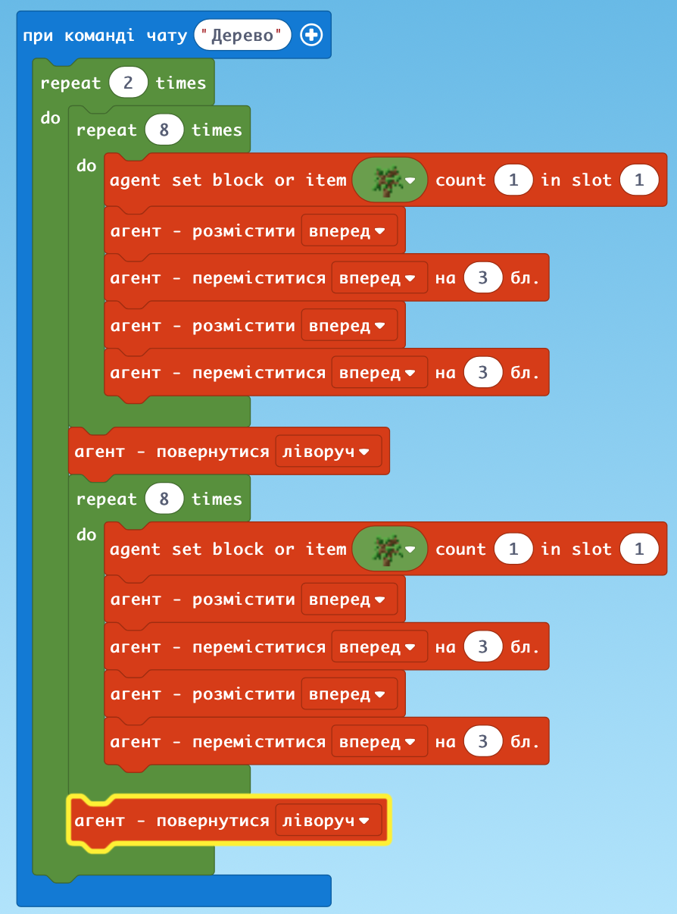
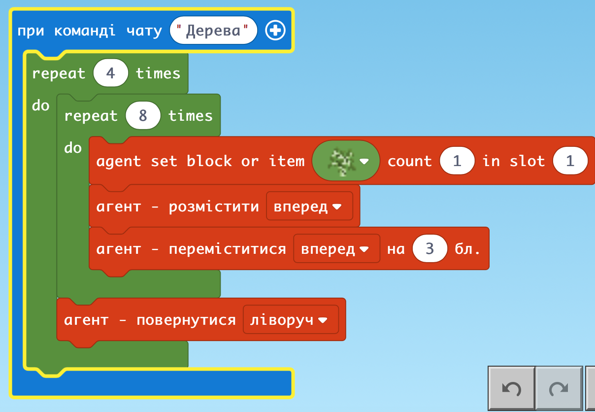
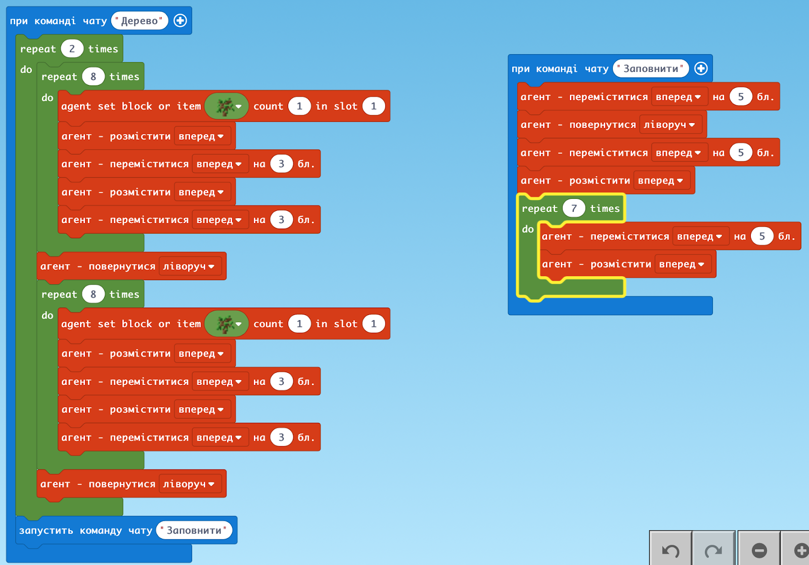

# Заняття 4. Програмний код

### Агент

Використовуємо блоки Basic i Гравець

### Агент - ваш помічник і виконує завдання

Він не може садити дерева в повітря чи в тому місці де вже щось чи хтось стоїть

Програма говоритиме про помилки

### Агенту команди

### Додаємо інвентар та саджаємо дерево

### Більше дерев

### Цілий ряд дерев

### Два ряди перпендикулярно

### Дерева по периметру квадрата

### Коротший

### Заповнюємо

