# Заняття 6. Руйнування. Тривимірні координати

### МегаСтрибок з використанням координат

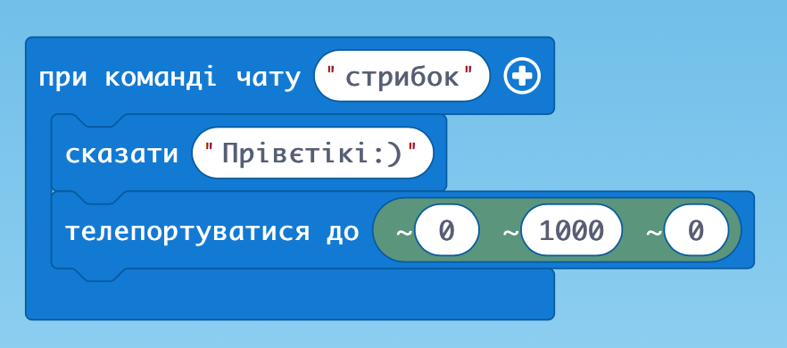

### Падіння героя

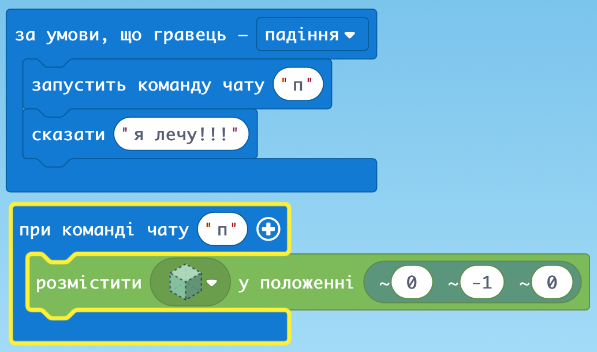

### Координати

В одну лінію за гравцем

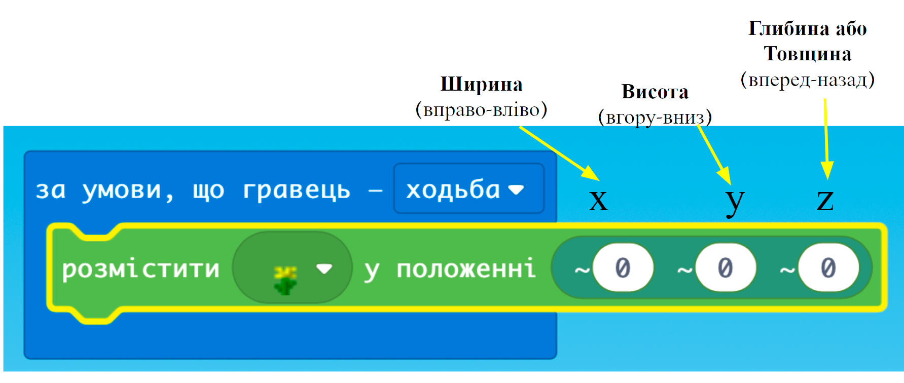

### Блоки для заповнення

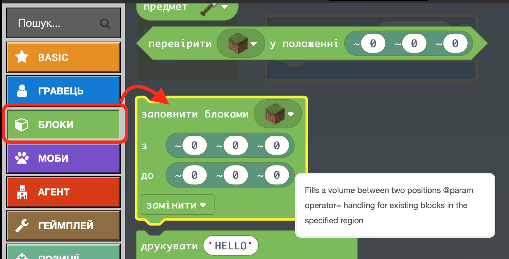

### Побудова стіни

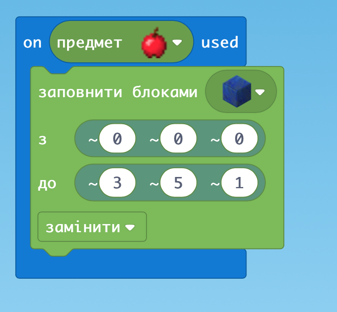

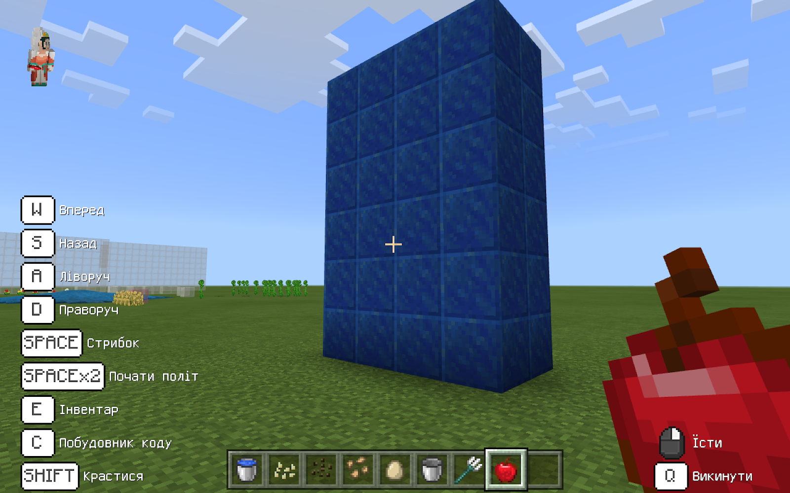

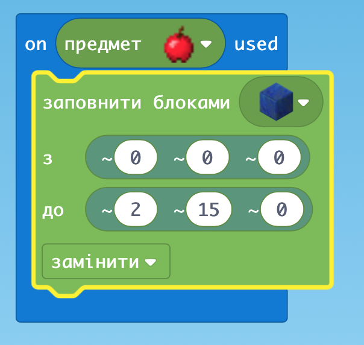

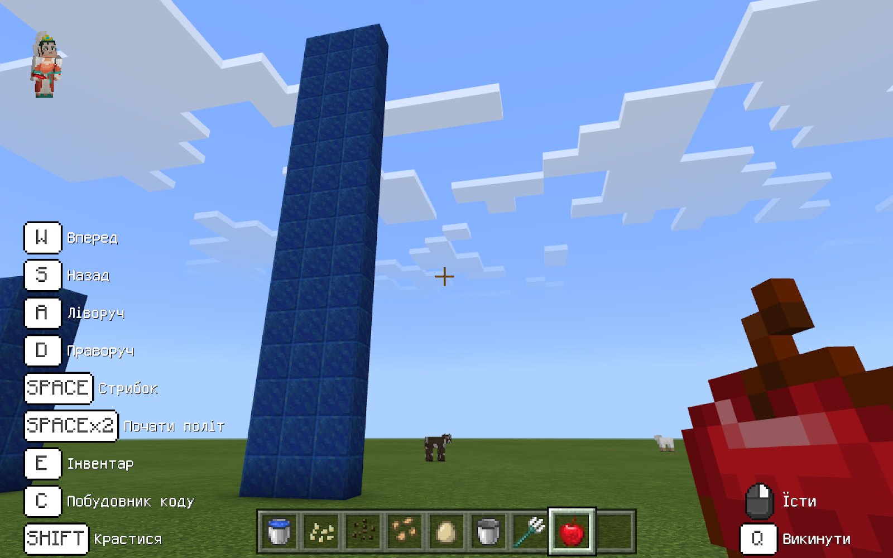

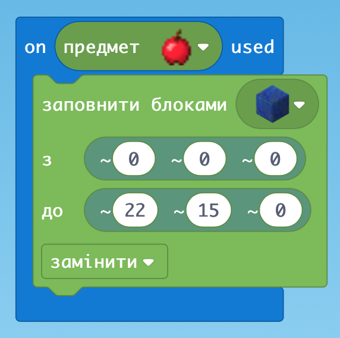

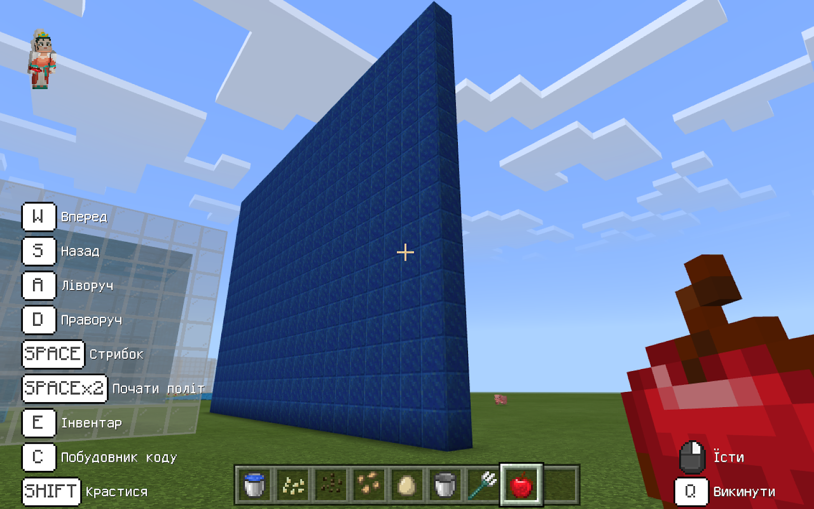

### Повний паралелепіпед

Всередині заповнений блоками

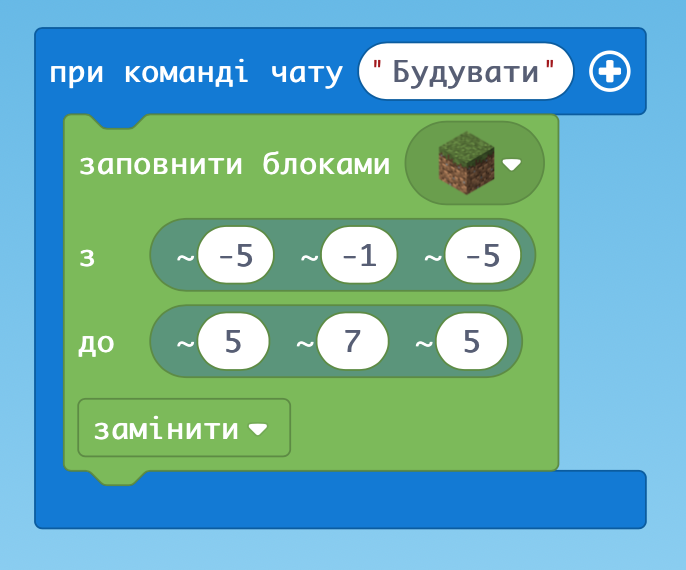

